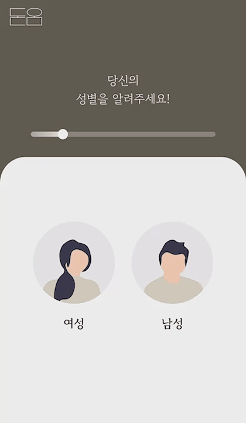
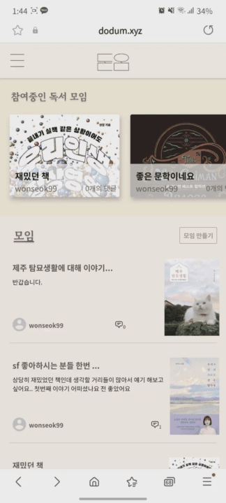
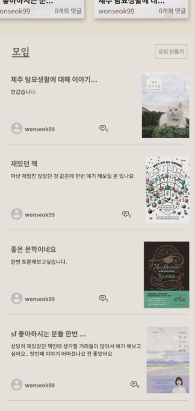
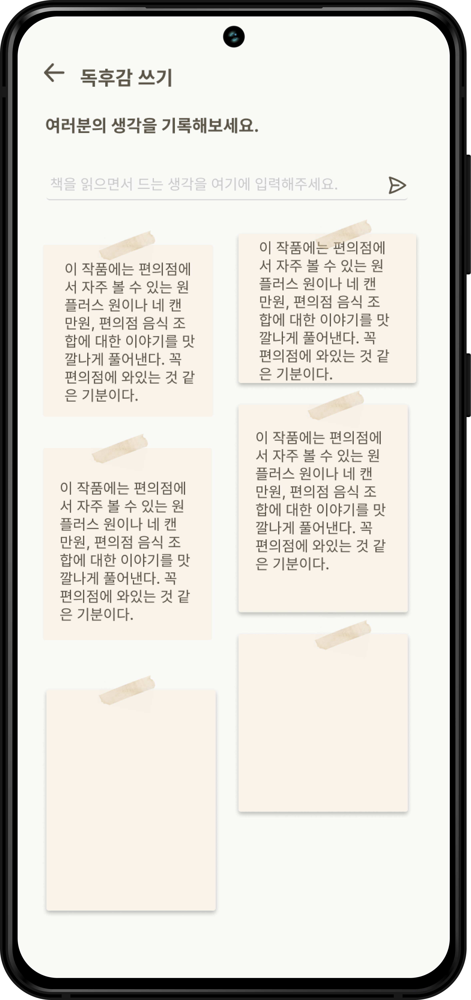
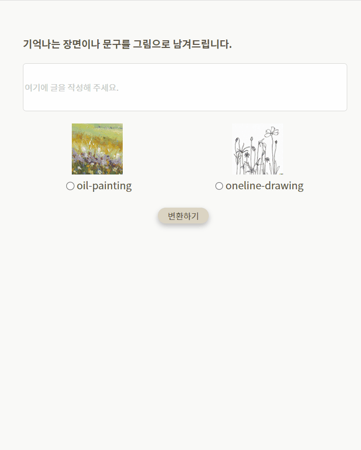
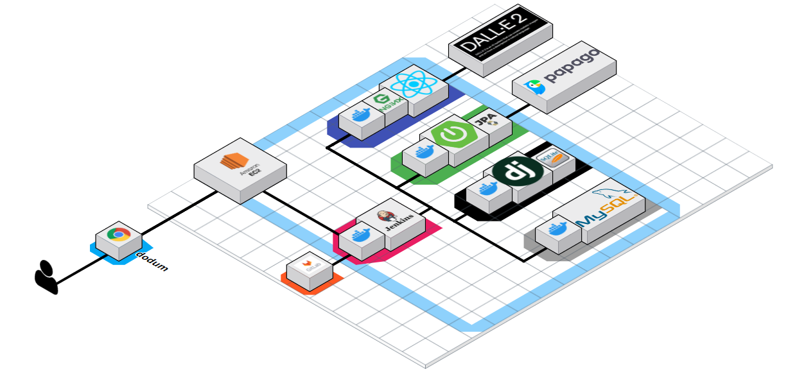

# 북돋움


<br/>
<br/>

## Book Dodum

> #### **"종이책을 즐겨읽는 사용자를 위한 빅데이터 기반 도서 추천 및 독서 모임 서비스"<br/>**
>
> <b style="color:#555555">프로젝트 기간 : 2023.02.20 ~ 2023.04.07</b>

<br/>

_북돋움은 사용자의 행동을 기반으로 **개인 맞춤형 도서 추천**을 제공하는 도서 추천 서비스 입니다. 북돋움에서는 동일한 책을 읽은 다른 사용자와 함께 **독서모임**에 참여할 수 있습니다. 사람들과 생각을 나누며, N권을 읽은 효과를 느껴보세요! 또한 독서를 끝내고 떠오르는 책의 분위기를 한 줄로 입력해 DALL-E가 변환해 주는 감성적인 이미지도 제공받을 수 있습니다. 쌓여가는 책을 '내 책방' 에서 확인해 보는 재미도 쏠쏠하답니다 :)_

<br/>
<br/>

---

<br/>
<br/>

## **Stacks**

#### **Environment**

<div style='display:flex;margin-bottom:20px'>


</div>

#### **CI/CD**

<div style='display:flex;margin-bottom:20px'>


</div>

#### **Development**

<div style='display:flex;margin-bottom:20px'>


</div>

#### **Comunication**

<div style='display:flex;margin-bottom:20px'>


</div>

<br/>
<br/>

---

<br/>
<br/>

## 주요 기능 📦

> ### 추천 기능

<div style="margin:10px 0 20px 0;display:flex">
 
 
</div>


데이터베이스에 존재하는 책마다 미리 만들어놓은 벡터들과 자연어처리한 토큰들로 고유한 행렬을 만들고, 유저 활동을 벡터별 가중치를 만들어서 이를 이용한 추천을 진행하고 있습니다.

```
if sum(user_matrix) == 0:
    user_matrix = np.array([0.00001]*len(user_matrix))
    user_matrix = list(map(lambda x: x/sum(user_matrix),user_matrix))
    user_matrix = np.array(user_matrix)

    C = np.dot(matrix, user_matrix)
    C = list(enumerate(C))
    C = sorted(C,key=lambda x: x[1], reverse=True)[:20]

    for book_idx in range(len(user_books)):
        data = Book.objects.get(isbn=user_books[book_idx])
        user_books[book_idx] = data.id
```

<br/>

> ### 독서 모임

<div style="margin:10px 0 20px 0;display:flex">
 
 
 
</div>

현재 읽고 있는 책을 중심으로 독서 모임을 생성하고, 생각을 나눌 수 있습니다. <br> 비공개로 설정한 모임에는 책을 읽었거나, 읽고 있는 사용자만 글을 작성할 수 있습니다.

<br/>

> ### 독후감 작성

<div style="margin:10px 0 20px 0;display:flex">
 
 
</div>

책을 읽으면서 독후감 페이지에서 독후감을 작성할 수 있습니다. <br> 책을 다 읽은 후 가장 기억에 남는 장면을 작성하면 이미지로 변환해줍니다.  

<br/>
<br/>

---

<br/>
<br/>

## 기대효과 🔔
<br/>

>### 추천

추천을 통해 책을 고르는 시간을 아낄 수 있습니다.<br> 또한 유저간에 무슨 책을 읽었는지, 다음에 무슨 책을 읽었는지 알 수 있어 다양한 분야의 책을 읽으며 식견을 넓힐 수 있습니다. 

<br/>

>### 독서모임

자신의 생각을 표현하며 한 번 더 책을 소화할 수 있습니다. <br> 이러한 생각을 사람들과 함께 공유함으로써 책 한권이 아닌 N권을 읽는 효과를 낼 수 있습니다. 

<br/>

>### 독후감작성

기록하지 않으면 기억에 잘 남지 않습니다. <br> 따라서 책을 읽을 때마다 독후감을 작성함으로써 오래 기억할 수 있게 합니다. 추가로 텍스트를 이미지로 변환해줌으로써 기억할 수 있는 효과를 극대화 해 줄 수 있습니다. 

<br/>
<br/>

---
## 프로젝트 파일 구조 ✔
### Backend
```
backend
├─ .idea
│  ├─ backend.iml
│  ├─ misc.xml
│  ├─ modules.xml
│  ├─ vcs.xml
│  └─ workspace.xml
├─ Django
│  ├─ books
│  │  ├─ admin.py
│  │  ├─ apps.py
│  │  ├─ fixtures
│  │  │  └─ books.json
│  │  ├─ migrations
│  │  │  ├─ 0001_initial.py
│  │  │  ├─ 0002_matrix.py
│  │  │  ├─ 0003_id.py
│  │  │  ├─ 0004_rename_isbns_id_isbn_books.py
│  │  │  ├─ 0005_rename_isbn_books_id_read_books.py
│  │  │  └─ __init__.py
│  │  ├─ models.py
│  │  ├─ serializers.py
│  │  ├─ tests.py
│  │  ├─ urls.py
│  │  ├─ views.py
│  │  └─ __init__.py
│  ├─ data
│  │  ├─ merged_data.csv
│  │  └─ merged_data.json
│  ├─ data_crawling.py
│  ├─ Dockerfile
│  ├─ image
│  │  └─ api목록.PNG
│  ├─ manage.py
│  ├─ MVP
│  │  ├─ asgi.py
│  │  ├─ settings.py
│  │  ├─ urls.py
│  │  ├─ wsgi.py
│  │  └─ __init__.py
│  ├─ new_books.json
│  ├─ README.md
│  ├─ register_data.json
│  └─ requirements.txt
└─ SpringFramework
   └─ bookdodum
      ├─ .DS_Store
      ├─ .gradle
      │  ├─ 7.4
      │  │  ├─ checksums
      │  │  │  ├─ checksums.lock
      │  │  │  ├─ md5-checksums.bin
      │  │  │  └─ sha1-checksums.bin
      │  │  ├─ dependencies-accessors
      │  │  │  ├─ dependencies-accessors.lock
      │  │  │  └─ gc.properties
      │  │  ├─ executionHistory
      │  │  │  ├─ executionHistory.bin
      │  │  │  └─ executionHistory.lock
      │  │  ├─ fileChanges
      │  │  │  └─ last-build.bin
      │  │  ├─ fileHashes
      │  │  │  ├─ fileHashes.bin
      │  │  │  └─ fileHashes.lock
      │  │  └─ gc.properties
      │  ├─ 7.6.1
      │  │  ├─ checksums
      │  │  │  ├─ checksums.lock
      │  │  │  ├─ md5-checksums.bin
      │  │  │  └─ sha1-checksums.bin
      │  │  ├─ dependencies-accessors
      │  │  │  ├─ dependencies-accessors.lock
      │  │  │  └─ gc.properties
      │  │  ├─ executionHistory
      │  │  │  ├─ executionHistory.bin
      │  │  │  └─ executionHistory.lock
      │  │  ├─ fileChanges
      │  │  │  └─ last-build.bin
      │  │  ├─ fileHashes
      │  │  │  ├─ fileHashes.bin
      │  │  │  ├─ fileHashes.lock
      │  │  │  └─ resourceHashesCache.bin
      │  │  └─ gc.properties
      │  ├─ buildOutputCleanup
      │  │  ├─ buildOutputCleanup.lock
      │  │  ├─ cache.properties
      │  │  └─ outputFiles.bin
      │  ├─ file-system.probe
      │  └─ vcs-1
      │     └─ gc.properties
      ├─ .idea
      │  ├─ compiler.xml
      │  ├─ gradle.xml
      │  ├─ inspectionProfiles
      │  │  └─ Project_Default.xml
      │  ├─ jarRepositories.xml
      │  ├─ misc.xml
      │  ├─ modules
      │  │  └─ bookdodum.main.iml
      │  ├─ uiDesigner.xml
      │  └─ vcs.xml
      ├─ build
      │  ├─ bootRunMainClassName
      │  ├─ classes
      │  │  └─ java
      │  │     └─ main
      │  │        └─ com
      │  │           └─ sasatech
      │  │              └─ bookdodum
      │  │                 ├─ config
      │  │                 │  ├─ PasswordEncoderConfigurations.class
      │  │                 │  ├─ QueryDslConfig.class
      │  │                 │  ├─ SwaggerConfig.class
      │  │                 │  └─ WebMvcConfig.class
      │  │                 ├─ controller
      │  │                 │  ├─ BookController.class
      │  │                 │  ├─ ExternalApiController.class
      │  │                 │  ├─ MeetingController.class
      │  │                 │  └─ UserController.class
      │  │                 ├─ dto
      │  │                 │  ├─ jwt
      │  │                 │  │  ├─ SignInResultDto$SignInResultDtoBuilder.class
      │  │                 │  │  ├─ SignInResultDto.class
      │  │                 │  │  └─ SignUpResultDto.class
      │  │                 │  ├─ request
      │  │                 │  │  ├─ book
      │  │                 │  │  │  ├─ BookConvertRequestDto$BookConvertRequestDtoBuilder.class
      │  │                 │  │  │  ├─ BookConvertRequestDto.class
      │  │                 │  │  │  ├─ BookRequestDto$BookRequestDtoBuilder.class
      │  │                 │  │  │  ├─ BookRequestDto.class
      │  │                 │  │  │  ├─ IsbnRequestDto$IsbnRequestDtoBuilder.class
      │  │                 │  │  │  ├─ IsbnRequestDto.class
      │  │                 │  │  │  ├─ PapagoRequestDto$PapagoRequestDtoBuilder.class
      │  │                 │  │  │  ├─ PapagoRequestDto.class
      │  │                 │  │  │  ├─ ReviewRequestDto$ReviewRequestDtoBuilder.class
      │  │                 │  │  │  └─ ReviewRequestDto.class
      │  │                 │  │  ├─ meeting
      │  │                 │  │  │  ├─ CommentRequestDto$CommentRequestDtoBuilder.class
      │  │                 │  │  │  ├─ CommentRequestDto.class
      │  │                 │  │  │  ├─ MeetingRequestDto$MeetingRequestDtoBuilder.class
      │  │                 │  │  │  └─ MeetingRequestDto.class
      │  │                 │  │  └─ user
      │  │                 │  │     ├─ UserLoginRequestDto$UserLoginRequestDtoBuilder.class
      │  │                 │  │     ├─ UserLoginRequestDto.class
      │  │                 │  │     ├─ UserSignupRequestDto$UserSignupRequestDtoBuilder.class
      │  │                 │  │     └─ UserSignupRequestDto.class
      │  │                 │  ├─ resposne
      │  │                 │  │  ├─ api
      │  │                 │  │  │  ├─ ApiResponseDto$ApiResponseDtoBuilder.class
      │  │                 │  │  │  ├─ ApiResponseDto$ApiResponseDtoBuilderImpl.class
      │  │                 │  │  │  └─ ApiResponseDto.class
      │  │                 │  │  ├─ book
      │  │                 │  │  │  ├─ BookDataResponseDto$BookDataResponseDtoBuilder.class
      │  │                 │  │  │  ├─ BookDataResponseDto.class
      │  │                 │  │  │  ├─ BookDetailResponseDto$BookDetailResponseDtoBuilder.class
      │  │                 │  │  │  ├─ BookDetailResponseDto.class
      │  │                 │  │  │  ├─ BookListResponseDto$BookListResponseDtoBuilder.class
      │  │                 │  │  │  ├─ BookListResponseDto.class
      │  │                 │  │  │  ├─ BookResponseDto$BookResponseDtoBuilder.class
      │  │                 │  │  │  ├─ BookResponseDto.class
      │  │                 │  │  │  ├─ NewBookDetailResponseDto$NewBookDetailResponseDtoBuilder.class
      │  │                 │  │  │  └─ NewBookDetailResponseDto.class
      │  │                 │  │  ├─ meeting
      │  │                 │  │  │  ├─ CommentListResponseDto$CommentListResponseDtoBuilder.class
      │  │                 │  │  │  ├─ CommentListResponseDto.class
      │  │                 │  │  │  ├─ MeetingListResponseDto$MeetingListResponseDtoBuilder.class
      │  │                 │  │  │  └─ MeetingListResponseDto.class
      │  │                 │  │  ├─ review
      │  │                 │  │  │  ├─ ReviewListResponseDto$ReviewListResponseDtoBuilder.class
      │  │                 │  │  │  └─ ReviewListResponseDto.class
      │  │                 │  │  └─ user
      │  │                 │  │     ├─ UserResponseDto$UserResponseDtoBuilder.class
      │  │                 │  │     └─ UserResponseDto.class
      │  │                 │  └─ user
      │  │                 │     └─ Gender.class
      │  │                 ├─ entity
      │  │                 │  ├─ book
      │  │                 │  │  ├─ Book$BookBuilder.class
      │  │                 │  │  ├─ Book.class
      │  │                 │  │  ├─ Category$CategoryBuilder.class
      │  │                 │  │  ├─ Category.class
      │  │                 │  │  ├─ QBook.class
      │  │                 │  │  ├─ QCategory.class
      │  │                 │  │  ├─ QReview.class
      │  │                 │  │  ├─ Review$ReviewBuilder.class
      │  │                 │  │  └─ Review.class
      │  │                 │  ├─ meeting
      │  │                 │  │  ├─ Comment$CommentBuilder.class
      │  │                 │  │  ├─ Comment.class
      │  │                 │  │  ├─ Meeting$MeetingBuilder.class
      │  │                 │  │  ├─ Meeting.class
      │  │                 │  │  ├─ QComment.class
      │  │                 │  │  ├─ QMeeting.class
      │  │                 │  │  ├─ QUserMeeting.class
      │  │                 │  │  ├─ UserMeeting$UserMeetingBuilder.class
      │  │                 │  │  └─ UserMeeting.class
      │  │                 │  └─ user
      │  │                 │     ├─ QUser.class
      │  │                 │     ├─ QUserBook.class
      │  │                 │     ├─ User$UserBuilder.class
      │  │                 │     ├─ User.class
      │  │                 │     ├─ UserBook$UserBookBuilder.class
      │  │                 │     └─ UserBook.class
      │  │                 ├─ ProjectApplication.class
      │  │                 ├─ repository
      │  │                 │  ├─ BookRepository.class
      │  │                 │  ├─ CategoryRepository.class
      │  │                 │  ├─ CommentRepository.class
      │  │                 │  ├─ CommentScrollQdslRepository.class
      │  │                 │  ├─ CommentScrollQdslRepositoryImpl.class
      │  │                 │  ├─ MeetingRepository.class
      │  │                 │  ├─ MeetingScrollQdslRepository.class
      │  │                 │  ├─ MeetingScrollQdslRepositoryImpl.class
      │  │                 │  ├─ ReviewRepository.class
      │  │                 │  ├─ UserBookQdslRepository.class
      │  │                 │  ├─ UserBookQdslRepositoryImpl.class
      │  │                 │  ├─ UserBookRepository.class
      │  │                 │  ├─ UserMeetingRepository.class
      │  │                 │  └─ UserRepository.class
      │  │                 ├─ security
      │  │                 │  ├─ common
      │  │                 │  │  └─ CommonResponse.class
      │  │                 │  ├─ CustomAcessDeniedHandler.class
      │  │                 │  ├─ CustomAuthenticationEntryPoint.class
      │  │                 │  ├─ EntryPointErrorResponse.class
      │  │                 │  ├─ JwtAuthenticationFilter.class
      │  │                 │  ├─ JwtTokenProvider.class
      │  │                 │  └─ SecurityConfiguration.class
      │  │                 └─ service
      │  │                    ├─ api
      │  │                    │  └─ ExternalApiService.class
      │  │                    ├─ book
      │  │                    │  ├─ BookService$1.class
      │  │                    │  ├─ BookService.class
      │  │                    │  ├─ ReviewService.class
      │  │                    │  └─ TranslationService.class
      │  │                    ├─ meeting
      │  │                    │  └─ MeetingService.class
      │  │                    └─ user
      │  │                       ├─ UserDetailServiceImpl.class
      │  │                       └─ UserService.class
      │  ├─ generated
      │  │  └─ sources
      │  │     └─ annotationProcessor
      │  │        └─ java
      │  │           └─ main
      │  │              └─ com
      │  │                 └─ sasatech
      │  │                    └─ bookdodum
      │  │                       └─ entity
      │  │                          ├─ book
      │  │                          │  ├─ QBook.java
      │  │                          │  ├─ QCategory.java
      │  │                          │  └─ QReview.java
      │  │                          ├─ meeting
      │  │                          │  ├─ QComment.java
      │  │                          │  ├─ QMeeting.java
      │  │                          │  └─ QUserMeeting.java
      │  │                          └─ user
      │  │                             ├─ QUser.java
      │  │                             └─ QUserBook.java
      │  ├─ resources
      │  │  └─ main
      │  │     └─ application.yml
      │  └─ tmp
      │     ├─ bootJar
      │     │  └─ MANIFEST.MF
      │     └─ compileJava
      │        └─ previous-compilation-data.bin
      ├─ build.gradle
      ├─ Dockerfile
      ├─ gradle
      │  └─ wrapper
      │     ├─ gradle-wrapper.jar
      │     └─ gradle-wrapper.properties
      ├─ gradlew
      ├─ isbn.png
      ├─ isbn1.png
      ├─ isbn2.png
      ├─ META-INF
      │  └─ MANIFEST.MF
      ├─ nginx.conf
      ├─ org
      │  └─ springframework
      │     └─ boot
      │        └─ loader
      │           ├─ archive
      │           │  ├─ Archive$Entry.class
      │           │  ├─ Archive$EntryFilter.class
      │           │  ├─ Archive.class
      │           │  ├─ ExplodedArchive$AbstractIterator.class
      │           │  ├─ ExplodedArchive$ArchiveIterator.class
      │           │  ├─ ExplodedArchive$EntryIterator.class
      │           │  ├─ ExplodedArchive$FileEntry.class
      │           │  ├─ ExplodedArchive$SimpleJarFileArchive.class
      │           │  ├─ ExplodedArchive.class
      │           │  ├─ JarFileArchive$AbstractIterator.class
      │           │  ├─ JarFileArchive$EntryIterator.class
      │           │  ├─ JarFileArchive$JarFileEntry.class
      │           │  ├─ JarFileArchive$NestedArchiveIterator.class
      │           │  └─ JarFileArchive.class
      │           ├─ ClassPathIndexFile.class
      │           ├─ data
      │           │  ├─ RandomAccessData.class
      │           │  ├─ RandomAccessDataFile$1.class
      │           │  ├─ RandomAccessDataFile$DataInputStream.class
      │           │  ├─ RandomAccessDataFile$FileAccess.class
      │           │  └─ RandomAccessDataFile.class
      │           ├─ ExecutableArchiveLauncher.class
      │           ├─ jar
      │           │  ├─ AbstractJarFile$JarFileType.class
      │           │  ├─ AbstractJarFile.class
      │           │  ├─ AsciiBytes.class
      │           │  ├─ Bytes.class
      │           │  ├─ CentralDirectoryEndRecord$1.class
      │           │  ├─ CentralDirectoryEndRecord$Zip64End.class
      │           │  ├─ CentralDirectoryEndRecord$Zip64Locator.class
      │           │  ├─ CentralDirectoryEndRecord.class
      │           │  ├─ CentralDirectoryFileHeader.class
      │           │  ├─ CentralDirectoryParser.class
      │           │  ├─ CentralDirectoryVisitor.class
      │           │  ├─ FileHeader.class
      │           │  ├─ Handler.class
      │           │  ├─ JarEntry.class
      │           │  ├─ JarEntryCertification.class
      │           │  ├─ JarEntryFilter.class
      │           │  ├─ JarFile$1.class
      │           │  ├─ JarFile$JarEntryEnumeration.class
      │           │  ├─ JarFile.class
      │           │  ├─ JarFileEntries$1.class
      │           │  ├─ JarFileEntries$EntryIterator.class
      │           │  ├─ JarFileEntries.class
      │           │  ├─ JarFileWrapper.class
      │           │  ├─ JarURLConnection$1.class
      │           │  ├─ JarURLConnection$JarEntryName.class
      │           │  ├─ JarURLConnection.class
      │           │  ├─ StringSequence.class
      │           │  └─ ZipInflaterInputStream.class
      │           ├─ JarLauncher.class
      │           ├─ jarmode
      │           │  ├─ JarMode.class
      │           │  ├─ JarModeLauncher.class
      │           │  └─ TestJarMode.class
      │           ├─ LaunchedURLClassLoader$DefinePackageCallType.class
      │           ├─ LaunchedURLClassLoader$UseFastConnectionExceptionsEnumeration.class
      │           ├─ LaunchedURLClassLoader.class
      │           ├─ Launcher.class
      │           ├─ MainMethodRunner.class
      │           ├─ PropertiesLauncher$1.class
      │           ├─ PropertiesLauncher$ArchiveEntryFilter.class
      │           ├─ PropertiesLauncher$ClassPathArchives.class
      │           ├─ PropertiesLauncher$PrefixMatchingArchiveFilter.class
      │           ├─ PropertiesLauncher.class
      │           ├─ util
      │           │  └─ SystemPropertyUtils.class
      │           └─ WarLauncher.class
      ├─ settings.gradle
      └─ src
         ├─ main
         │  ├─ java
         │  │  └─ com
         │  │     └─ sasatech
         │  │        └─ bookdodum
         │  │           ├─ config
         │  │           │  ├─ PasswordEncoderConfigurations.java
         │  │           │  ├─ QueryDslConfig.java
         │  │           │  ├─ SwaggerConfig.java
         │  │           │  └─ WebMvcConfig.java
         │  │           ├─ controller
         │  │           │  ├─ BookController.java
         │  │           │  ├─ ExternalApiController.java
         │  │           │  ├─ MeetingController.java
         │  │           │  └─ UserController.java
         │  │           ├─ dto
         │  │           │  ├─ jwt
         │  │           │  │  ├─ SignInResultDto.java
         │  │           │  │  └─ SignUpResultDto.java
         │  │           │  ├─ request
         │  │           │  │  ├─ book
         │  │           │  │  │  ├─ BookConvertRequestDto.java
         │  │           │  │  │  ├─ BookRequestDto.java
         │  │           │  │  │  ├─ IsbnRequestDto.java
         │  │           │  │  │  ├─ PapagoRequestDto.java
         │  │           │  │  │  └─ ReviewRequestDto.java
         │  │           │  │  ├─ meeting
         │  │           │  │  │  ├─ CommentRequestDto.java
         │  │           │  │  │  └─ MeetingRequestDto.java
         │  │           │  │  └─ user
         │  │           │  │     ├─ UserLoginRequestDto.java
         │  │           │  │     └─ UserSignupRequestDto.java
         │  │           │  ├─ resposne
         │  │           │  │  ├─ api
         │  │           │  │  │  └─ ApiResponseDto.java
         │  │           │  │  ├─ book
         │  │           │  │  │  ├─ BookDataResponseDto.java
         │  │           │  │  │  ├─ BookDetailResponseDto.java
         │  │           │  │  │  ├─ BookListResponseDto.java
         │  │           │  │  │  ├─ BookResponseDto.java
         │  │           │  │  │  └─ NewBookDetailResponseDto.java
         │  │           │  │  ├─ meeting
         │  │           │  │  │  ├─ CommentListResponseDto.java
         │  │           │  │  │  └─ MeetingListResponseDto.java
         │  │           │  │  ├─ review
         │  │           │  │  │  └─ ReviewListResponseDto.java
         │  │           │  │  └─ user
         │  │           │  │     └─ UserResponseDto.java
         │  │           │  └─ user
         │  │           │     └─ Gender.java
         │  │           ├─ entity
         │  │           │  ├─ book
         │  │           │  │  ├─ Book.java
         │  │           │  │  ├─ Category.java
         │  │           │  │  └─ Review.java
         │  │           │  ├─ meeting
         │  │           │  │  ├─ Comment.java
         │  │           │  │  ├─ Meeting.java
         │  │           │  │  └─ UserMeeting.java
         │  │           │  └─ user
         │  │           │     ├─ User.java
         │  │           │     └─ UserBook.java
         │  │           ├─ ProjectApplication.java
         │  │           ├─ repository
         │  │           │  ├─ BookRepository.java
         │  │           │  ├─ CategoryRepository.java
         │  │           │  ├─ CommentRepository.java
         │  │           │  ├─ CommentScrollQdslRepository.java
         │  │           │  ├─ CommentScrollQdslRepositoryImpl.java
         │  │           │  ├─ MeetingRepository.java
         │  │           │  ├─ MeetingScrollQdslRepository.java
         │  │           │  ├─ MeetingScrollQdslRepositoryImpl.java
         │  │           │  ├─ ReviewRepository.java
         │  │           │  ├─ UserBookQdslRepository.java
         │  │           │  ├─ UserBookQdslRepositoryImpl.java
         │  │           │  ├─ UserBookRepository.java
         │  │           │  ├─ UserMeetingRepository.java
         │  │           │  └─ UserRepository.java
         │  │           ├─ security
         │  │           │  ├─ common
         │  │           │  │  └─ CommonResponse.java
         │  │           │  ├─ CustomAcessDeniedHandler.java
         │  │           │  ├─ CustomAuthenticationEntryPoint.java
         │  │           │  ├─ EntryPointErrorResponse.java
         │  │           │  ├─ JwtAuthenticationFilter.java
         │  │           │  ├─ JwtTokenProvider.java
         │  │           │  └─ SecurityConfiguration.java
         │  │           └─ service
         │  │              ├─ api
         │  │              │  └─ ExternalApiService.java
         │  │              ├─ book
         │  │              │  ├─ BookService.java
         │  │              │  ├─ ReviewService.java
         │  │              │  └─ TranslationService.java
         │  │              ├─ meeting
         │  │              │  └─ MeetingService.java
         │  │              └─ user
         │  │                 ├─ UserDetailServiceImpl.java
         │  │                 └─ UserService.java
         │  └─ resources
         │     └─ application.yml
         └─ test
            └─ java
               └─ com
                  └─ sasatech
                     └─ bookdodum
                        └─ ProjectApplicationTests.java

```

### Frontend
```
frontend
├─ .env
├─ Dockerfile
├─ package-lock.json
├─ package.json
├─ public
│  ├─ favicon.ico
│  └─ index.html
└─ src
   ├─ apis
   │  ├─ auth.ts
   │  ├─ changeImage.js
   │  ├─ detail.ts
   │  ├─ isbn.ts
   │  ├─ library.ts
   │  ├─ meeting.ts
   │  ├─ read.ts
   │  ├─ reading.ts
   │  ├─ readwith.ts
   │  ├─ recommend.ts
   │  ├─ saveImage.ts
   │  ├─ survey.ts
   │  ├─ translate.ts
   │  └─ write.ts
   ├─ App.css
   ├─ App.tsx
   ├─ Assets
   │  ├─ Fonts
   │  └─ Images
   │     └─ survey
   ├─ Components
   │  ├─ Common
   │  │  ├─ Loading.tsx
   │  │  ├─ Nav.tsx
   │  │  ├─ ScrollTop.tsx
   │  │  └─ SideBar.tsx
   │  └─ Contents
   │     ├─ Book.tsx
   │     ├─ BookBanner.tsx
   │     ├─ BookCover.tsx
   │     ├─ DetailModal.tsx
   │     ├─ ImageAI.tsx
   │     ├─ MeetingCover.tsx
   │     ├─ NavBack.tsx
   │     └─ ReadingBooks.tsx
   ├─ custom.d.ts
   ├─ font.d.ts
   ├─ index.css
   ├─ index.tsx
   ├─ pages
   │  ├─ Home
   │  │  ├─ Banner.tsx
   │  │  ├─ BestKeyword.tsx
   │  │  ├─ BookList.tsx
   │  │  ├─ index.tsx
   │  │  ├─ LibraryBooks.tsx
   │  │  └─ Recommend.tsx
   │  ├─ ImageConvertor
   │  │  ├─ Form.tsx
   │  │  ├─ ImageLoading.tsx
   │  │  ├─ Images.tsx
   │  │  └─ index.tsx
   │  ├─ Intro
   │  │  └─ index.tsx
   │  ├─ Isbn
   │  │  ├─ Check.tsx
   │  │  └─ index.tsx
   │  ├─ Library
   │  │  ├─ index.tsx
   │  │  ├─ LibraryList.tsx
   │  │  └─ LibraryModal.tsx
   │  ├─ Login
   │  │  └─ index.tsx
   │  ├─ Meeting
   │  │  ├─ Button.tsx
   │  │  ├─ index.tsx
   │  │  ├─ List.tsx
   │  │  └─ ListCard.tsx
   │  ├─ MeetingCreate
   │  │  └─ index.tsx
   │  ├─ MeetingRoom
   │  │  ├─ index.tsx
   │  │  ├─ List.tsx
   │  │  └─ ListCard.tsx
   │  ├─ Mypage
   │  │  ├─ Index.tsx
   │  │  ├─ MypageBanner.tsx
   │  │  └─ Read.tsx
   │  ├─ ReadingBooks
   │  │  ├─ index.tsx
   │  │  ├─ MeetingList.tsx
   │  │  ├─ UserList.tsx
   │  │  └─ UserProfile.tsx
   │  ├─ RecommendList
   │  │  └─ index.tsx
   │  ├─ Signup
   │  │  └─ Index.tsx
   │  ├─ Survey
   │  │  ├─ EmotionCard.tsx
   │  │  ├─ FieldCard.tsx
   │  │  ├─ GenderCard.tsx
   │  │  ├─ index.tsx
   │  │  ├─ ReasonCard.tsx
   │  │  ├─ Result.tsx
   │  │  └─ Step.tsx
   │  └─ WriteText
   │     ├─ Comment.tsx
   │     ├─ index.tsx
   │     └─ TextForm.tsx
   ├─ Store
   │  ├─ index.ts
   │  ├─ Types.ts
   │  └─ userSlice.ts
   └─ Styles
      ├─ GlobalFont.ts
      └─ GlobalStyle.ts
```

---
## 아키텍처 설계도



<br/>
<br/>

---
## 와이어프레임 


<br/>
<br/>

--- 

<br/>
<br/>


## 팀원 소개

|        |    |        |          |          |        |
| :--------------------------------------------: | :-----------------------------------------: | :--------------------------------------------: | :-------------------------------------------------: | :----------------------------------------------: | :----------------------------------------------: |
| **[FE 최지우👑](https://github.com/choizlor)** | **[FE 김유나](https://yunae.tistory.com/)** | **[FE 나혜승](https://github.com/HyeseungNA)** | **[BE 최종욱](https://whitedevelper.tistory.com/)** | **[BE 이원석](https://github.com/wonseokLee97)** | **[AI 이창민](https://changmiin2.tistory.com/)** |

<br/>
<br/>

---